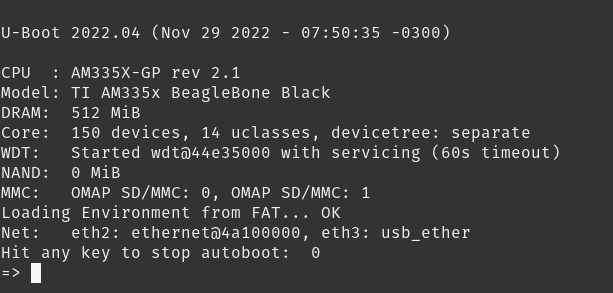
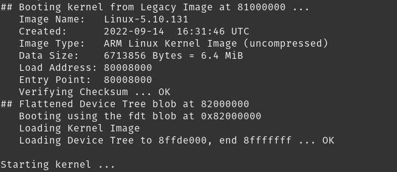
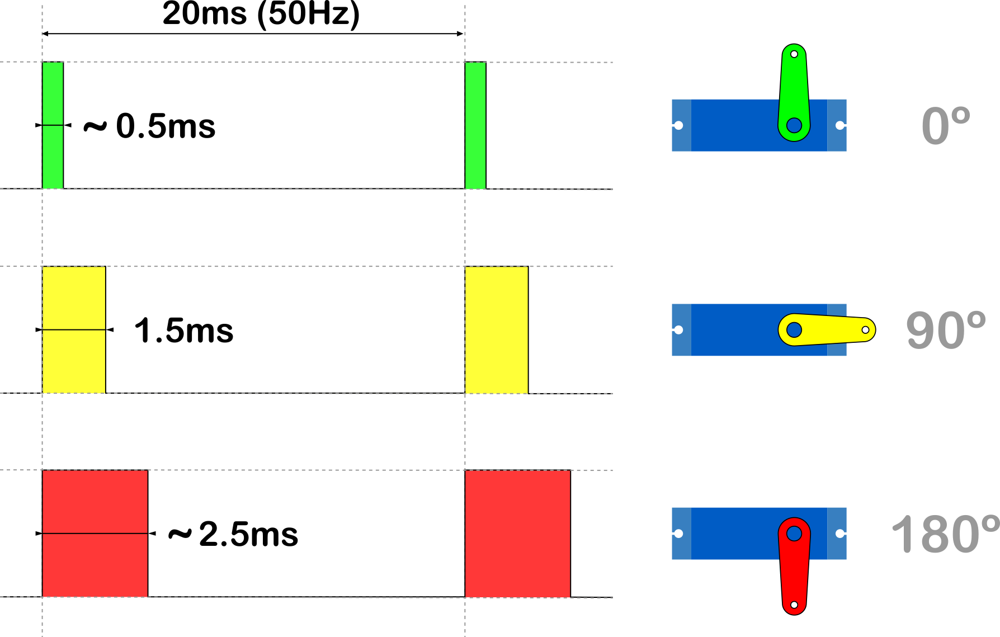
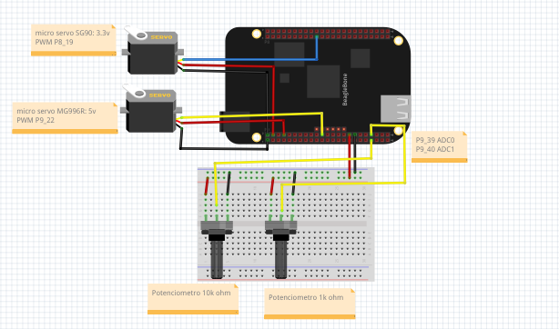
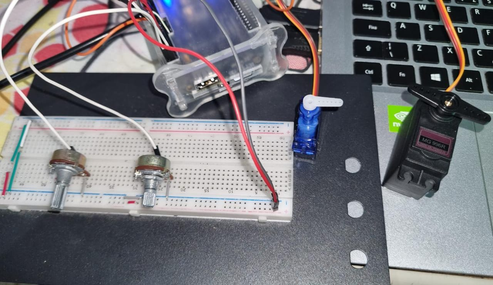

# Controlling servo motor with potentiometer in Beaglebone Black, using Embedded Linux

## Descrição (PT-BR)

A ideia principal era tentar reproduzir um mini guincho fazendo o controle de dois servo-motor de forma concorrente, a partir da leitura do pino analógico da beaglebone.

## Ambiente utilizado

- Beaglebone Black;

- Linguagem C, fazendo uso da biblioteca Pthread;

- Linaro GCC (cross-toolchain);

- Sistema de arquivo personalizado (criação via Buildroot)

   **U-boot info** |  **Kernel info**
    ---               | ---
     | 

  - Inclusão externa de overlays PWM e ADC;
  
## Diagrama da largura de pulso e sua posição correspondente do servo-motor para 0°, 90° e 180°



## Esquemático



## Compilação

```sh
make
```

## Limpar objetos

```sh
make clean
```

---

## Registros do Funcionamento (Vídeo)

[](https://youtu.be/slQF-iVoVEUs)

## Referências

[Wilmer Gaona](https://wgaonar.github.io/)
